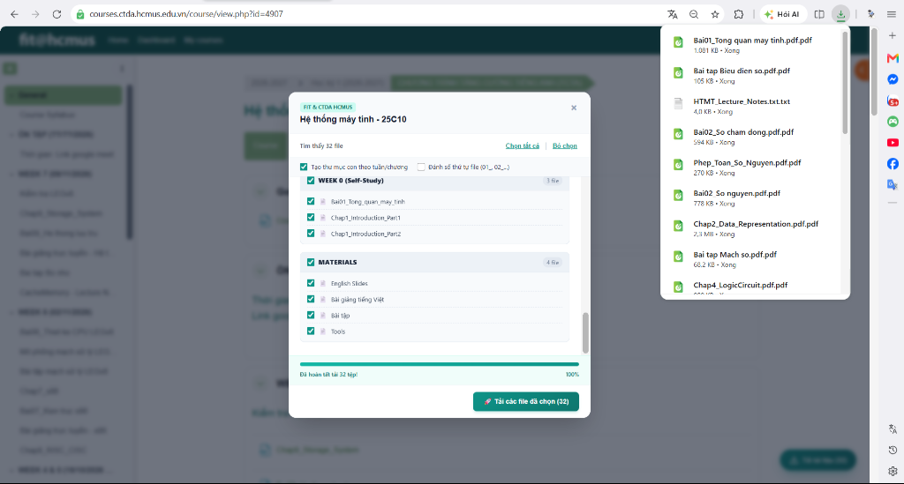

# Moodle Course Resource Downloader

Công cụ hỗ trợ tải toàn bộ tài liệu học tập (PDF, Slide, Bài giảng, Đề thi) của một môn học trên hệ thống Moodle (FIT@HCMUS, CTDA) trực tiếp về máy tính.



---

## Tính năng

- **Tải hàng loạt nhanh chóng:** Tự động gửi lệnh tải cho toàn bộ tài liệu đã chọn mà không cần click thủ công từng file.
- **Tự động gom thư mục môn học & tuần:** Tự động tạo thư mục môn học và các thư mục con theo chương/tuần (`Tài liệu chung/`, `WEEK 1/`, `WEEK 2/`...), không bị vứt file lẻ ra ngoài `Downloads`.
- **Bộ lọc nhu cầu học tập:** Lọc nhanh chỉ chọn Slide/Bài giảng để ôn lý thuyết, hoặc chỉ chọn Bài tập/Lab để làm bài.
- **Hai phương thức linh hoạt:** Sử dụng trực tiếp qua **Bookmarklet** (không cần cài đặt) hoặc cài đặt làm **Chrome Extension**.
- **Bảo toàn phiên đăng nhập:** Chạy trực tiếp với cookie session của trình duyệt, không cần đăng nhập lại hay lo lỗi SSO/CAS.

---

## Phương thức 1: Sử dụng Bookmarklet (Không cần cài đặt)

Đây là cách nhanh nhất để sử dụng trên bất kỳ trình duyệt nào (Chrome, Edge, Brave, Cốc Cốc):

1. Bật thanh Dấu trang của trình duyệt bằng tổ hợp phím `Ctrl + Shift + B`.
2. Tạo một dấu trang mới trên thanh Dấu trang:
   - **Tên:** `Moodle Downloader`
   - **Địa chỉ (URL):** Dán đoạn mã sau:
     ```javascript
     javascript:(function(){var s=document.createElement('script');s.src='https://1am1am.github.io/moodle-resource-downloader/bookmarklet.js?t='+Date.now();document.head.appendChild(s);})();
     ```
3. Truy cập vào trang môn học bất kỳ trên Moodle (ví dụ: `courses.ctda.hcmus.edu.vn/course/view.php?id=...`).
4. Nhấn vào dấu trang **Moodle Downloader** vừa tạo.
5. Chọn các tệp bạn muốn và bấm **Tải tài liệu vào thư mục**.
6. Hộp thoại Windows/trình duyệt sẽ hỏi bạn muốn lưu vào thư mục nào (ví dụ chọn thư mục `Downloads`), công cụ sẽ tự động tạo thư mục `[Tên môn]/[Tuần hoặc Chương]/` và lưu toàn bộ file vào đúng các thư mục con!

---

## Phương thức 2: Cài đặt Chrome Extension

Dành cho người dùng muốn có nút bấm tự động xuất hiện ở góc trang web và tự tạo thư mục con trên máy tính:

1. Tải tệp `moodle-downloader-extension.zip` từ trang phát hành hoặc repository.
2. Giải nén tệp zip ra một thư mục trên máy tính.
3. Mở trình duyệt Chrome và truy cập:
   ```text
   chrome://extensions
   ```
4. Bật công tắc **Developer mode (Chế độ cho nhà phát triển)** ở góc trên bên phải.
5. Nhấn nút **Load unpacked (Tải tiện ích đã giải nén)** và chọn thư mục vừa giải nén.
6. Mở trang khóa học Moodle và nhấn `F5` để thấy nút **Tải tài liệu** ở góc dưới bên phải màn hình.

---

## Trang chủ và Hướng dẫn trực quan

Xem trang giới thiệu và trải nghiệm kéo thả Bookmarklet tại:
👉 [https://1am1am.github.io/moodle-resource-downloader/](https://1am1am.github.io/moodle-resource-downloader/)
